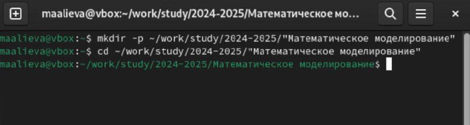
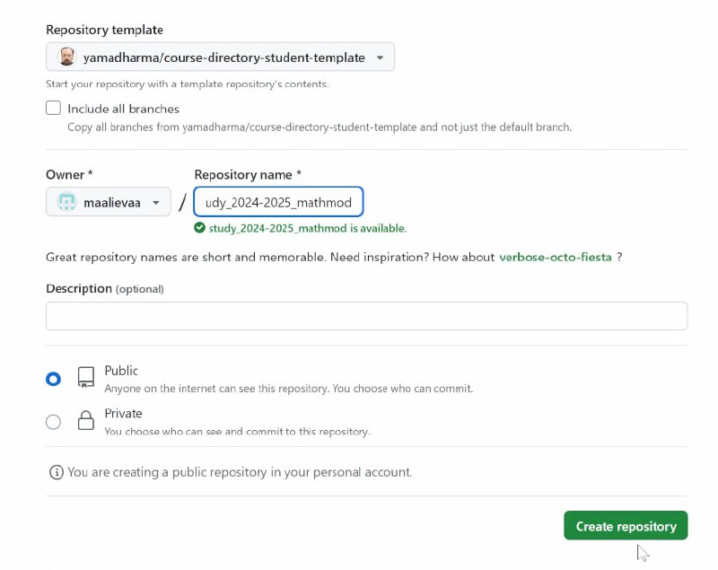
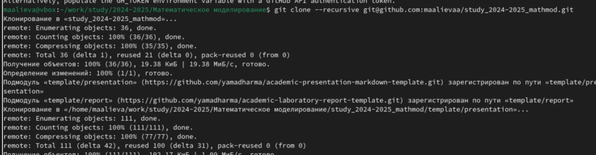
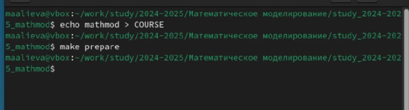
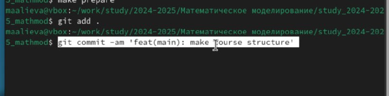
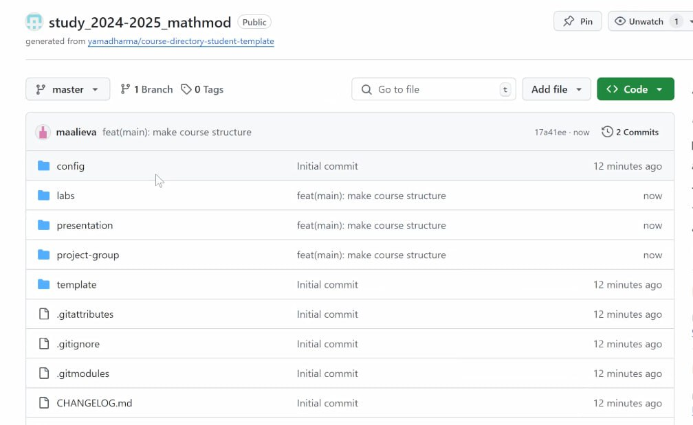

---
## Front matter
lang: ru-RU
title: Лабораторная работа №1
subtitle: Настройка рабочего пространства
author:
  - Алиева Милена Арифовна
institute:
  - Российский университет дружбы народов, Москва, Россия

## i18n babel
babel-lang: russian
babel-otherlangs: english

## Formatting pdf
toc: false
toc-title: Содержание
slide_level: 2
aspectratio: 169
section-titles: true
theme: metropolis
header-includes:
 - \metroset{progressbar=frametitle,sectionpage=progressbar,numbering=fraction}
 - '\makeatletter'
 - '\beamer@ignorenonframefalse'
 - '\makeatother'
---

# Содержание 

1. Цель
2. Задания
3. Порядок выполнения
4. Вывод

# Цель

Настроить рабочее пространство для дальнейшей работы

# Задание

1. Настроить github
2. Настроить markdown

# Порядок выполнения

1.  Создадим новый каталог для данного курса, перейдём в него (рис. [-@fig:001]).

{#fig:001 width=70%}

# Порядок выполнения

2. Создадим репозиторий на основе предложенного шаблона, назовём его study_2024-2025_mathmod (рис. [-@fig:002]).

{#fig:002 width=70%}

# Порядок выполнения

3. Клонируем репозиторий в наш каталог (рис. [-@fig:003]).

{#fig:003 width=70%}

# Порядок выполнения

4. Чтобы создать нужную структуру курса, создадим необходимые каталоги  (рис. [-@fig:004]).

{#fig:004 width=70%}

# Порядок выполнения

5. Отправим файлы на сервер (рис. [-@fig:005]).

{#fig:005 width=70%}

# Порядок выполнения

6. Проверим, что всё выгрузилось корректно и github готов к работе (рис. [-@fig:006]).

{#fig:006 width=70%}

# Выводы

В процессе выполнения данной лабораторной работы я настроила github для дальнейшей работы на курсе
