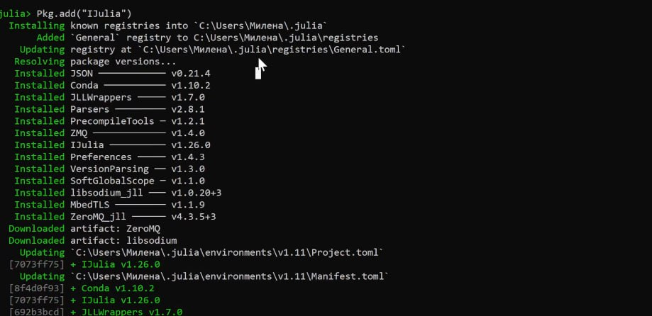
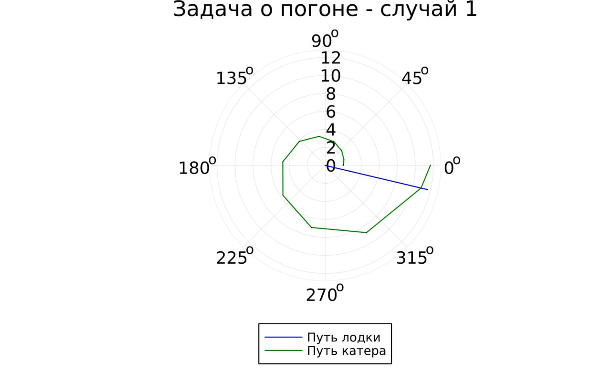
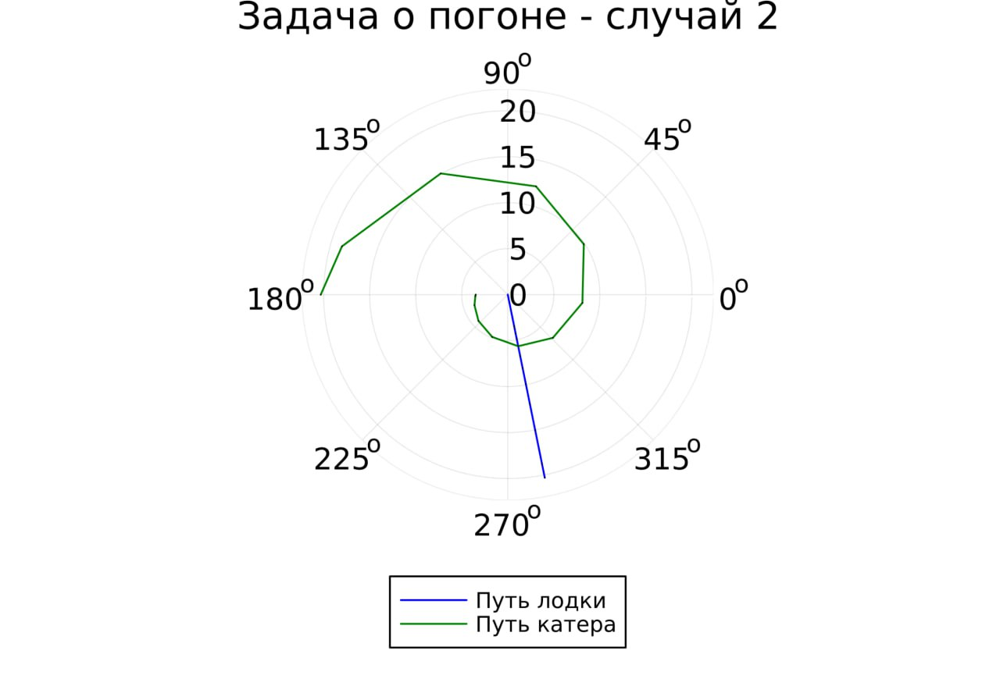

---
## Front matter
title: "Лабораторная работа №2"
subtitle: "Задача о погоне"
author: "Алиева Милена Арифовна"

## Generic otions
lang: ru-RU
toc-title: "Содержание"

## Bibliography
bibliography: bib/cite.bib
csl: pandoc/csl/gost-r-7-0-5-2008-numeric.csl

## Pdf output format
toc: true # Table of contents
toc-depth: 2
lof: true # List of figures
lot: true # List of tables
fontsize: 12pt
linestretch: 1.5
papersize: a4
documentclass: scrreprt
## I18n polyglossia
polyglossia-lang:
  name: russian
  options:
  - spelling=modern
  - babelshorthands=true
polyglossia-otherlangs:
  name: english
## I18n babel
babel-lang: russian
babel-otherlangs: english
## Fonts
## Fonts
mainfont: PT Serif
romanfont: PT Serif
sansfont: PT Sans
monofont: PT Mono
mainfontoptions: Ligatures=TeX
romanfontoptions: Ligatures=TeX
sansfontoptions: Ligatures=TeX,Scale=MatchLowercase
monofontoptions: Scale=MatchLowercase,Scale=0.9
## Biblatex
biblatex: true
biblio-style: "gost-numeric"
biblatexoptions:
  - parentracker=true
  - backend=biber
  - hyperref=auto
  - language=auto
  - autolang=other*
  - citestyle=gost-numeric
## Pandoc-crossref LaTeX customization
figureTitle: "Рис."
tableTitle: "Таблица"
listingTitle: "Листинг"
lofTitle: "Список иллюстраций"
lotTitle: "Список таблиц"
lolTitle: "Листинги"
## Misc options
indent: true
header-includes:
  - \usepackage{indentfirst}
  - \usepackage{float} # keep figures where there are in the text
  - \floatplacement{figure}{H} # keep figures where there are in the text
---

# Цель работы

Построить математическую модель для выбора правильной стратегии при решении примера задаче о погоне.

# Задание

На море в тумане катер береговой охраны преследует лодку браконьеров.
Через определенный промежуток времени туман рассеивается, и лодка обнаруживается на расстоянии 9,4 км от катера. Затем лодка снова скрывается в тумане и уходит прямолинейно в неизвестном направлении. Известно, что скорость катера в 3,7 раза больше скорости браконьерской лодки.

1. Записать уравнение, описывающее движение катера, с начальными условиями для двух случаев (в зависимости от расположения катера относительно лодки в начальный момент времени).

2. Построить траекторию движения катера и лодки для двух случаев.

3. Найти точку пересечения траектории катера и лодки 

# Выполнение лабораторной работы

1. Формула для выбора варианта: `(1132226430%70)+1` = 21 вариант.

2. Запишем уравнение описывающее движение катера, с начальными условиями для двух случаев (в зависимости от расположения катера относительно лодки в начальный момент времени).

Принимем за $t_0 = 0$, $x_0 = 0$ -- место нахождения лодки браконьеров в момент обнаружения,$x_{k0} = k$ - место нахождения катера береговой охраны относительно лодки браконьеров в момент обнаружения лодки.

Введем полярные координаты. Считаем, что полюс - это точка обнаружения лодки браконьеров $x_{k0}$ ($\theta = x_{k0} = 0$), а полярная ось $r$ проходит через точку нахождения катера береговой охраны.

Траектория катера должна быть такой, чтобы и катер, и лодка все время были на одном расстоянии от полюса $\theta$ , только в этом случае траектория
катера пересечется с траекторией лодки. Поэтому для начала катер береговой охраны должен двигаться некоторое время прямолинейно, пока не окажется на том же расстоянии от полюса, что и лодка браконьеров. После этого катер береговой охраны должен двигаться вокруг полюса удаляясь от него с той же скоростью, что и лодка браконьеров.

Чтобы найти расстояние $x$ (расстояние после которого катер начнет двигаться вокруг полюса), необходимо составить простое уравнение. Пусть через время $t$ катер и лодка окажутся на одном расстоянииx от полюса. За это время лодка пройдет $x$ , а катер $k-x$ (или $k+x$, в зависимости от начального положения катера относительно полюса). Время, за которое они пройдут это расстояние, вычисляется как $\dfrac{x}{v}$ или $\dfrac{k-x}{3.7v}$ (во втором случае $\dfrac{k+x}{3.7v}$). Так как время одно и то же, то эти величины одинаковы. Тогда неизвестное расстояниеx можно найти из следующего уравнения:

$$
\dfrac{x}{v} = \dfrac{k-x}{3.7v} \text{ -- в первом случае}
$$
$$
\dfrac{x}{v} = \dfrac{k+x}{3.7v} \text{ -- во втором}
$$

Отсюда мы найдем два значения $x_1 = \dfrac{9.4}{4.7}$ и $x_2 = \dfrac{9.4}{2.7}$, задачу будем решать для двух случаев.

После того, как катер береговой охраны окажется на одном расстоянии от полюса, что и лодка, он должен сменить прямолинейную траекторию и начать двигаться вокруг полюса удаляясь от него со скоростью лодки $v$. Для этого скорость катера раскладываем на две составляющие: $v_{r}$ - радиальная скорость и  - $v_{\tau}$ тангенциальная скорость. Радиальная скорость - это скорость, с которой катер удаляется от полюса, $v_r = \dfrac{dr}{dt}$. Нам нужно, чтобы эта скорость была равна скорости лодки, поэтому полагаем $\dfrac{dr}{dt} = v$.

Тангенциальная скорость – это линейная скорость вращения катера относительно полюса. Она равна произведению угловой скорости $\dfrac{d \theta}{dt}$ на радиус $r$, $r \dfrac{d \theta}{dt}$.

Получаем: 

$$v_{\tau} = \sqrt{13.69v^2-v^2} = \sqrt{12.69}v$$

Из чего можно вывести:

$$
r\dfrac{d \theta}{dt} = \sqrt{12.69}v
$$

Решение исходной задачи сводится к решению системы из двух дифференциальных уравнений:

$$\begin{cases}
&\dfrac{dr}{dt} = v\\
&r\dfrac{d \theta}{dt} = \sqrt{12.69}v
\end{cases}$$

С начальными условиями для первого случая:

$$\begin{cases}
&{\theta}_0 = 0\\  \tag{1}
&r_0 = \dfrac{9.4}{4.7}
\end{cases}$$

Или для второго:

$$\begin{cases}
&{\theta}_0 = -\pi\\  \tag{2}
&r_0 = \dfrac{9.4}{2.7}
\end{cases}$$

Исключая из полученной системы производную по $t$, можно перейти к следующему уравнению:

$$
\dfrac{dr}{d \theta} = \dfrac{r}{\sqrt{12.69}}
$$

Начальные условия остаются прежними. Решив это уравнение, мы получим траекторию движения катера в полярных координатах.

3. Решить дифференциальное уравнение, расписанное в постановке задачи лабораторной работы, поможет библиотека DifferentialEquations. Итоговые изображения в полярных координатах будут строиться через библиотеку Plots. Загрузим дополнительно эти библиотеки.

Установим Julia, настроим работу в Jupyter notebook (рис. [-@fig:001]):

{#fig:001 width=70%}

4. Далее разработаем код для решения дифференциального уравнения и построения изображения:

Код:

```

using Plots
using DifferentialEquations

# расстояние от лодки до катера
const a = 9.4
const n = 3.7

# расстояние начала спирали
const r0 = a/(n + 1)  # начальное расстояние для первого случая
const r0_2 = a/(n - 1) # начальное расстояние для второго случая

# интервал времени
const T = (0, 2*pi)    # интервал времени для первого случая
const T_2 = (-pi, pi)  # интервал времени для второго случая

# функция, описывающая изменение радиуса в зависимости от времени
function F(u, p, t)
    return u / sqrt(n*n - 1)  # уравнение ОДУ
end

# задача ОДУ для первого случая
problem = ODEProblem(F, r0, T)

# решение задачи ОДУ
result = solve(problem, abstol=1e-8, reltol=1e-8)
@show result.u  # вывод значений радиуса
@show result.t   # вывод значений времени

# генерация случайных индексов для выбора углов
dxR = rand(1:size(result.t)[1])
rAngles = [result.t[dxR] for i in 1:size(result.t)[1]]  # выбор случайных углов

# создание первого холста
plt = plot(proj=:polar, aspect_ratio=:equal, dpi = 1000, legend=true, bg=:white)

# параметры для первого холста
plot!(plt, xlabel="theta", ylabel="r(t)", title="Задача о погоне - случай 1", legend=:outerbottom)
plot!(plt, [rAngles[1], rAngles[2]], [0.0, result.u[size(result.u)[1]]], label="Путь лодки", color=:blue, lw=1)
scatter!(plt, rAngles, result.u, label="", mc=:blue, ms=0.0005)  # точки пути лодки
plot!(plt, result.t, result.u, xlabel="theta", ylabel="r(t)", label="Путь катера", color=:green, lw=1)
scatter!(plt, result.t, result.u, label="", mc=:green, ms=0.0005)  # точки пути катера

# сохранение первого холста в файл
savefig(plt, "lab02_01.png")

# задача ОДУ для второго случая
problem = ODEProblem(F, r0_2 , T_2)
result = solve(problem, abstol=1e-8, reltol=1e-8)
dxR = rand(1:size(result.t)[1])  # генерация случайных индексов для второго случая
rAngles = [result.t[dxR] for i in 1:size(result.t)[1]]  # выбор случайных углов

# создание второго холста
plt1 = plot(proj=:polar, aspect_ratio=:equal, dpi = 1000, legend=true, bg=:white)

# параметры для второго холста
plot!(plt1, xlabel="theta", ylabel="r(t)", title="Задача о погоне - случай 2", legend=:outerbottom)
plot!(plt1, [rAngles[1], rAngles[2]], [0.0, result.u[size(result.u)[1]]], label="Путь лодки", color=:blue, lw=1)
scatter!(plt1, rAngles, result.u, label="", mc=:blue, ms=0.0005)  # точки пути лодки
plot!(plt1, result.t, result.u, xlabel="theta", ylabel="r(t)", label="Путь катера", color=:green, lw=1)
scatter!(plt1, result.t, result.u, label="", mc=:green, ms=0.0005)  # точки пути катера

# сохранение второго холста в файл
savefig(plt1, "lab02_02.png")

```

5. Получим два изображения - для первого и для второго случаев (рис. [-@fig:002]), (рис. [-@fig:003]):

{#fig:002 width=70%}

{#fig:003 width=70%}

# Выводы

В процессе выполнения лабораторной работы №2 я научилась строить математическую модель для выбора правильной стратегии при решении примера задаче о погоне.

