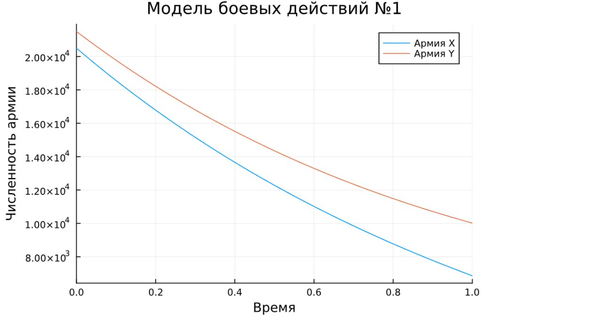
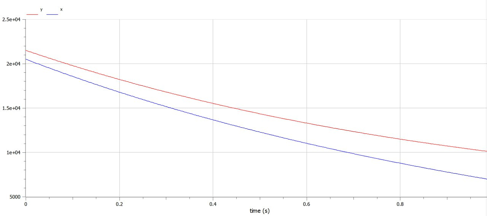
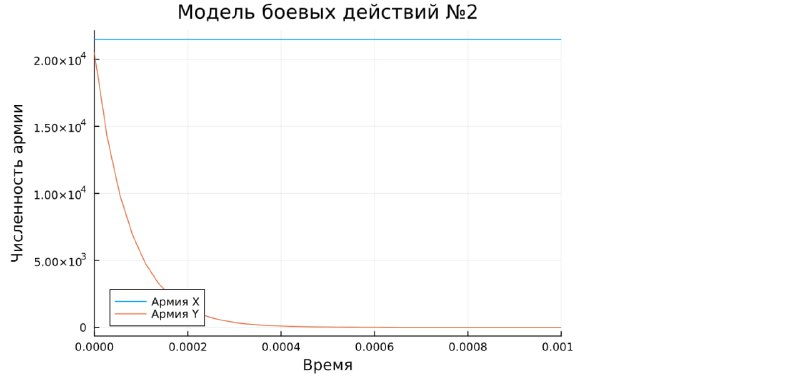
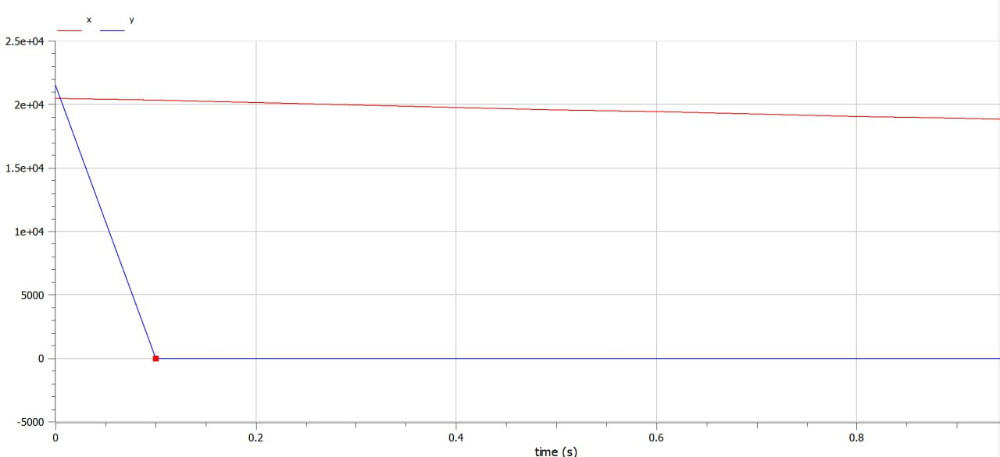

---
## Front matter
lang: ru-RU
title: Лабораторная работа №3
subtitle: Модель боевых действий
author:
  - Алиева Милена Арифовна
institute:
  - Российский университет дружбы народов, Москва, Россия

## i18n babel
babel-lang: russian
babel-otherlangs: english

## Formatting pdf
toc: false
toc-title: Содержание
slide_level: 2
aspectratio: 169
section-titles: true
theme: metropolis
header-includes:
 - \metroset{progressbar=frametitle,sectionpage=progressbar,numbering=fraction}
 - '\makeatletter'
 - '\beamer@ignorenonframefalse'
 - '\makeatother'
---

# Содержание 

1. Цель
2. Задания
3. Порядок выполнения
4. Вывод

# Цель работы

Построить модель боевых действий на языке программирования Julia и посредством ПО OpenModelica.

# Задание

Между страной $X$ и страной $Y$ идет война. Численность состава войск
исчисляется от начала войны, и являются временными функциями $x(t)$ и $y(t)$. В
начальный момент времени страна $X$ имеет армию численностью 20500 человек,
а в распоряжении страны $Y$ армия численностью в 21500 человек. Для упрощения
модели считаем, что коэффициенты $a, b, c, h$ постоянны. Также считаем $P(t)$ и $Q(t)$ непрерывные функции.

# Задание

Построить графики изменения численности войск армии $X$ и армии $Y$ для  следующих случаев:

1. Модель боевых действий между регулярными войсками
$$\begin{cases}
    \dfrac{dx}{dt} = -0.21x(t)- 0.74y(t)+sin(t)+0,5\\
    \dfrac{dy}{dt} = -0.68x(t)- 0.19y(t)+cos(t)+0,5
\end{cases}$$

# Задание

2. Модель ведение боевых действий с участием регулярных войск и партизанских отрядов

$$\begin{cases}
    \dfrac{dx}{dt} = -0.09x(t)-0.79y(t)+sin(2t)\\
    \dfrac{dy}{dt} = -0.62x(t)y(t)-0.11y(t)+cos(2t)
\end{cases}$$

# Выполнение лабораторной работы

1. Модель боевых действий между регулярными войсками

$$\begin{cases}
    \dfrac{dx}{dt} = -0.21x(t)- 0.74y(t)+sin(t)+0,5\\
    \dfrac{dy}{dt} = -0.68x(t)- 0.19y(t)+cos(t)+0,5
\end{cases}$$

# Выполнение лабораторной работы

Для начала построим эту модель на Julia:


```Julia
# используемые библиотеки
using DifferentialEquations, Plots;

# задание системы дифференциальных уравнений, описывающих модель 
# боевых действий между регулярными войсками
function reg(u, p, t)
    x, y = u
    a, b, c, h = p
    dx = -a*x - b*y+sin(t)+0.5
    dy = -c*x -h*y+cos(t)+0.5
    return [dx, dy]
end
```

# Выполнение лабораторной работы

```
# начальные условия
u0 = [20500, 21500]
p = [0.21, 0.74, 0.68, 0.19]
tspan = (0,1)
```

# Выполнение лабораторной работы

```
# постановка проблемы
prob = ODEProblem(reg, u0, tspan, p)

# решение системы ДУ
sol = solve(prob, Tsit5())

# построение графика, который описывает изменение численности армий
plot(sol, title = "Модель боевых действий №1",  label = ["Армия X" "Армия Y"], xaxis = "Время", yaxis = "Численность армии")
```

# Выполнение лабораторной работы

В результате получаем следующий график (рис. [-@fig:001]):

# Выполнение лабораторной работы

{#fig:001 width=70%}

# Выполнение лабораторной работы

Видим, что армия Х несёт потери быстрее, чем армия Y.

Теперь построим эту же модель посредством OpenModelica.

# Выполнение лабораторной работы

```OpenModelica
model lab3
  parameter Real a = 0.21;
  parameter Real b = 0.74;
  parameter Real c = 0.68;
  parameter Real h = 0.19;
  parameter Real x0 = 20500;
  parameter Real y0 = 21500;
```

# Выполнение лабораторной работы

```
  Real x(start=x0);
  Real y(start=y0);
equation
  der(x) = -a*x - b*y+sin(time)+0.5;
  der(y) = -c*x -h*y+cos(time)+0.5;
end lab3;
```
# Выполнение лабораторной работы

В результате получаем следующий график изменения численности армий (рис. [-@fig:002]):

# Выполнение лабораторной работы

{#fig:002 width=70%}

# Выполнение лабораторной работы

Видим, что армия Х несёт потери быстрее, чем армия Y, как и на графике, построенном с помощью Julia.
 
# Выполнение лабораторной работы

2. Модель ведение боевых действий с участием регулярных войск и партизанских отрядов

$$\begin{cases}
    \dfrac{dx}{dt} = -0.09x(t)-0.79y(t)+sin(2t)\\
    \dfrac{dy}{dt} = -0.62x(t)y(t)-0.11y(t)+cos(2t)
\end{cases}$$

# Выполнение лабораторной работы

Построим модель на Julia:

```Julia
# задание системы дифференциальных уравнений, описывающих модель 
# боевых действий с участием регулярных войск и партизанских отрядов
function reg_part(u, p, t)
    x, y = u
    a, b, c, h = p
    dx = -a*x - b*y+sin(2*t)
    dy = -c*x*y -h*y+cos(2*t)
    return [dx, dy]
end
```

# Выполнение лабораторной работы 

```
# начальные условия
u0 = [20500, 21500]
p = [0.09, 0.79, 0.62, 0.12]
tspan = (0,1)

# постановка проблемы
prob2 = ODEProblem(reg_part, u0, tspan, p)
```

# Выполнение лабораторной работы

```
# решение системы ДУ
sol2 = solve(prob2, Tsit5())

# построение графика, который описывает изменение численности армий
plot(sol2, title = "Модель боевых действий №2", label = ["Армия X" "Армия Y"], xaxis = "Время", yaxis = "Численность армии", xlimit = [0,0.001])
```
# Выполнение лабораторной работы

В результате получаем следующий график изменения численности армий (рис. [-@fig:003]):

# Выполнение лабораторной работы

{#fig:003 width=70%}

# Выполнение лабораторной работы

Теперь выполним построение второй модели в Open Modelica. Код выглядит следующим образом:

```OpenModelica
model lab32
parameter Real a = 0.09;
  parameter Real b = 0.79;
  parameter Real c = 0.62;
  parameter Real h = 0.11;
  parameter Real x0 = 20500;
  parameter Real y0 = 21500;
  Real x(start=x0);
  Real y(start=y0);
```

# Выполнение лабораторной работы

```
equation
  der(x) = -a*x - b*y+sin(2*time);
  der(y) = -c*x*y -h*y+cos(2*time);
end lab32;
```
# Выполнение лабораторной работы

В результате получается такой график:

# Выполнение лабораторной работы

{#fig:004 width=70%}

# Выводы

В процессе выполнения данной лабораторной работы я построила модель боевых действий на языке программирования Julia и посредством ПО OpenModelica, а также провела сравнительный анализ.
